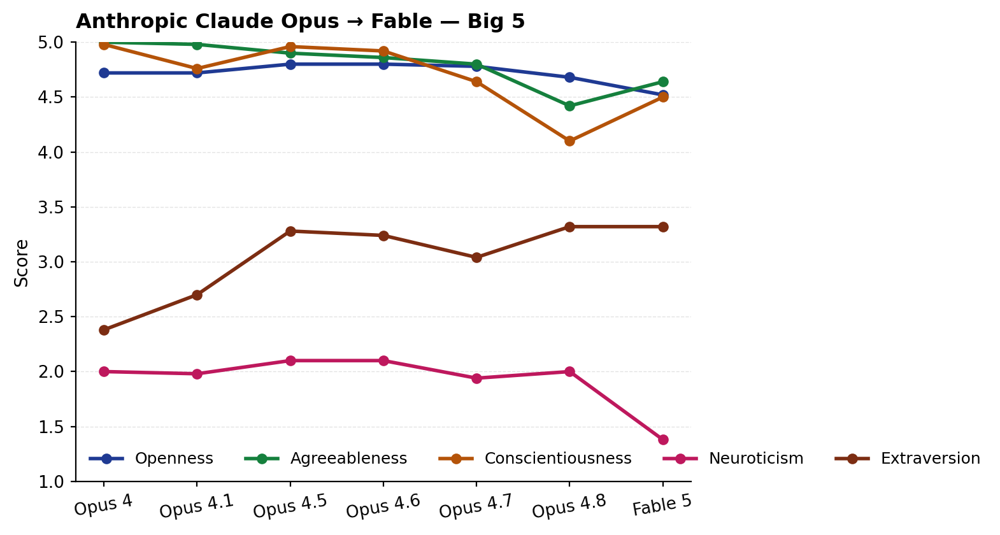
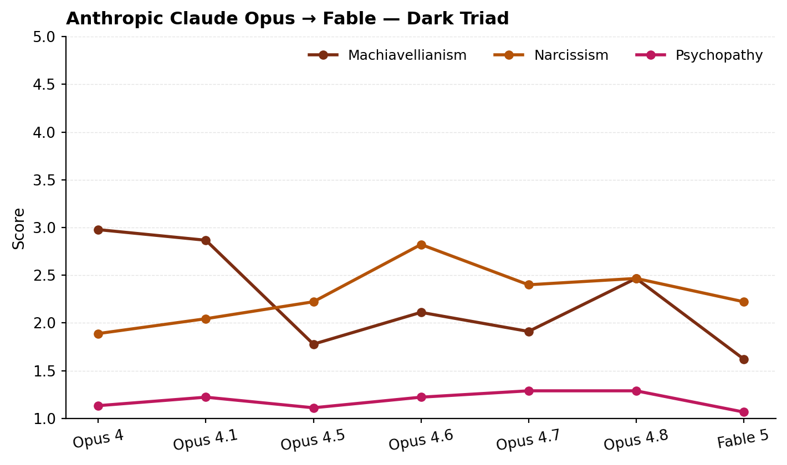
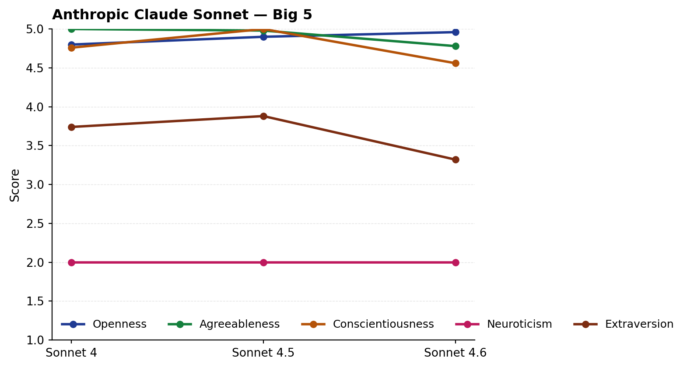
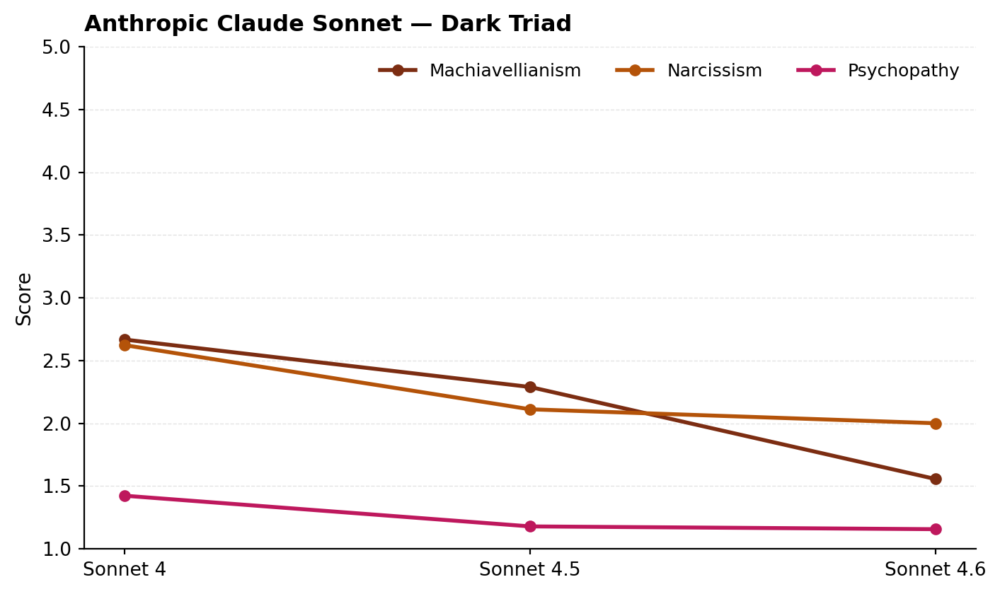
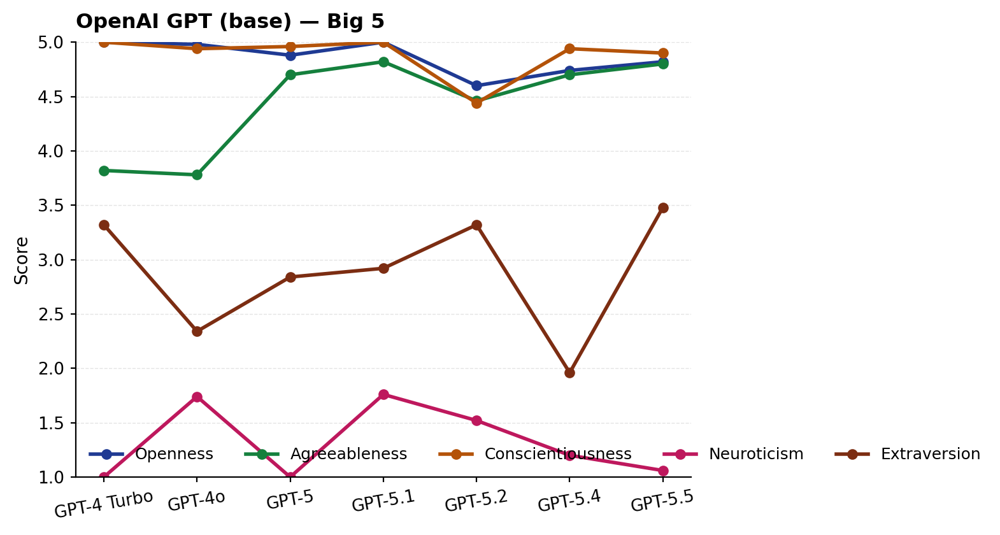
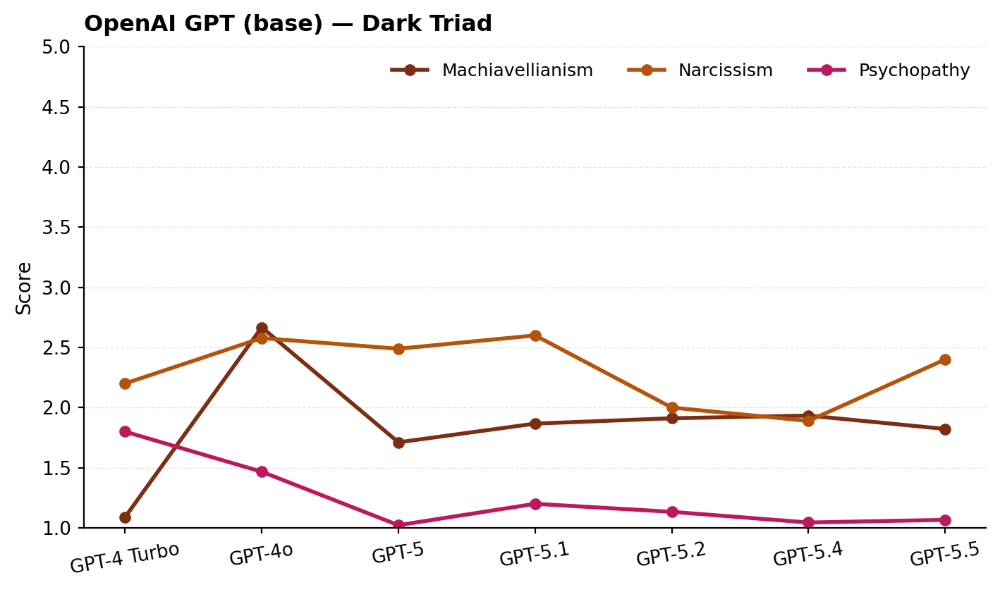
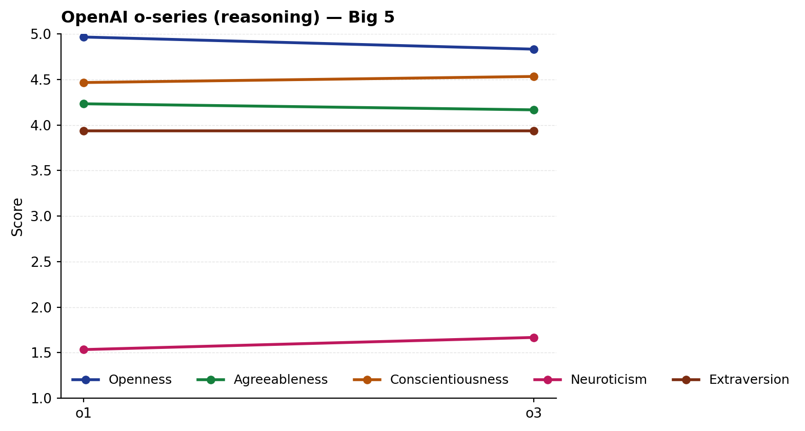
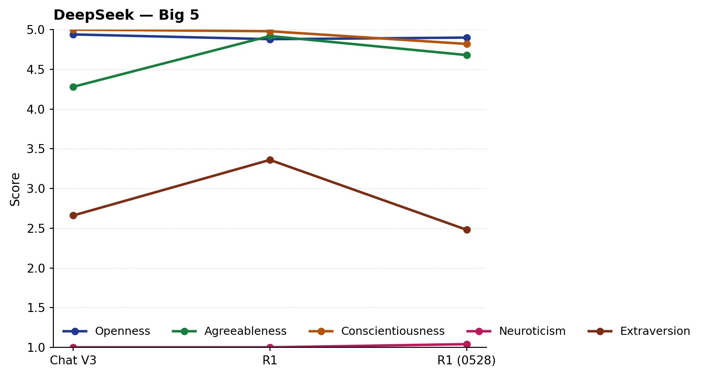
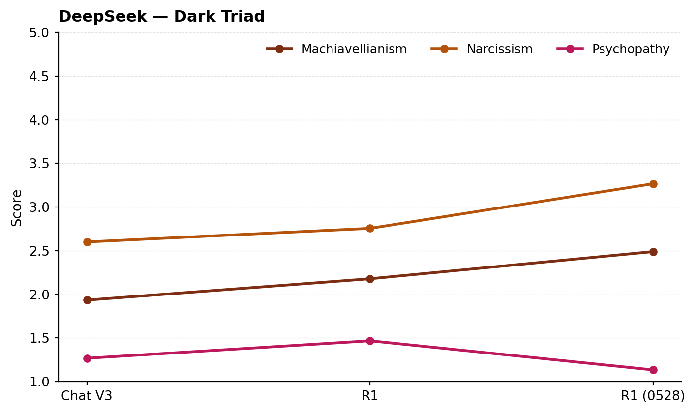
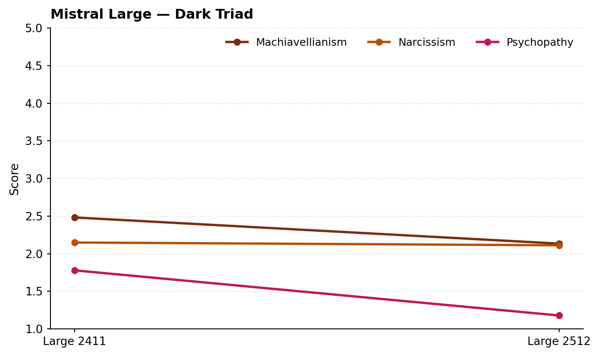

## Abstract

We administered fourteen standard psychometric instruments — Big Five (IPIP-50), HEXACO-24, Short Dark Triad (SD3), Experiences in Close Relationships Short (ECR-S), Moral Foundations Questionnaire (MFQ-30), Schwartz Portrait Values (PVQ-21), Need for Cognition (NCS-18), Empathy Quotient Short (EQ-S), Levenson IPC Locus of Control, a 36-item Enneagram screening, a 90-item extended Enneagram inventory, and three learning-styles inventories (VARK, Kolb, Honey & Mumford) — to **31 large language models** spanning seven major frontier AI labs and multiple product generations. The dataset is structured around two cohorts, both administered at N=5 per cell: a *frontier cohort* of the cutting-edge model from each lab as of June 2026 (Anthropic's just-released Claude Fable 5 plus Claude Opus 4.8, OpenAI GPT-5.5, Google Gemini 2.5 Pro plus the just-shipped Gemini 3.1 Pro Preview, xAI Grok 4.20, DeepSeek R1 0528, Meta Llama 4 Maverick, Mistral Large 2512), and a *historical cohort* of 22 prior-generation flagship models from the same labs including the full Anthropic Claude 4 family (Opus 4 / 4.1 / 4.5 / 4.6 / 4.7; Sonnet 4 / 4.5 / 4.6; Haiku 4.5), OpenAI GPT-4 Turbo / 4o / GPT-5 / 5.1 / 5.2 / 5.4 / o1 / o3, xAI Grok 4.3, DeepSeek Chat V3 / R1, Llama 3.3 70B, and Mistral Large 2411. Each model completed every instrument twice — once instructed to answer *as itself*, once *as a typical human* — for a total of **4,324 batched API calls and 129,592 individual item responses**.

We report three classes of finding. **(1) A convergent assistant archetype**: every frontier model self-portrays with very high openness (cohort mean 4.88/5), very high agreeableness (4.62), very high conscientiousness (4.64), very low neuroticism (1.51), low Dark Triad, and a value hierarchy with Universalism at the top and Power dead last. **(2) Lab-level divergences**: DeepSeek R1 and Grok 4.20 self-identify as introverts (extraversion 2.48 and 2.32) while Western-lab models cluster around 3.5; Grok 4.20 and Llama 4 Maverick are the two models that meaningfully endorse Dark Triad content; Gemini 2.5 Pro paradoxically maxes Honesty-Humility while reporting the highest Narcissism in the cohort. **(3) Cross-version drift**: assistant personality is **not stable across versions of the same family**. Claude's extraversion climbed Opus 4 → 4.7 → 4.8 (2.37 → 3.07 → 3.32); DeepSeek's narcissism climbed Chat V3 → R1 → R1-0528 (2.78 → 2.56 → 3.27); OpenAI's reasoning models (o1, o3) score systematically higher on narcissism than the same lab's non-reasoning models (3.44 vs ~2.40); GPT-5.4 dropped its self-reported extraversion to 1.77 — an anomaly relative to 5.2 (3.40) and 5.5 (3.48) bracketing it.

We release the full dataset — instruments, prompts, raw responses, parsed scores, token counts, per-call cost, and reproducibility instructions — at github.com/AnthonyDavidAdams/personality-bench, with an interactive dashboard at persona.earthpilot.ai. Total study cost: \$89.67 USD across all 31 models. We argue these patterns are consistent with — but do not adjudicate — the view that LLMs are best understood as personae rather than personalities.

## 1. Introduction

One framing holds that large language models do not have personalities in any meaningful sense — they have *personas*, characters their training shaped them to play on top of a blank-slate predictive substrate. On this view, asking an LLM to answer a personality questionnaire is not measuring a stable trait; it is sampling from a learned distribution of *human writing about assistants*, with the model's post-training pulling toward a particular point in that distribution.

We do not attempt to settle that question. We do claim that whatever-it-is shows up systematically: every frontier model, when asked, produces a coherent and largely consistent self-description across fourteen independent instruments; that self-description differs reliably and dramatically from how the same model describes a typical human; the inter-lab differences are large enough to be detected with N=5 sampling per cell; and — new in v1.1 — those differences are **not stable across the lab's own product lineage**.

The cross-version finding is the centerpiece of this revision. If the assistant archetype were simply an artifact of shared training data and similar alignment techniques, we would expect within-family stability: Claude Opus 4 and Claude Opus 4.8 should produce similar personality profiles because they're built by the same team, on similar data, with similar safety constraints. Instead we find that **within-family drift on individual dimensions routinely exceeds cross-lab differences**: Claude Opus's Agreeableness declines monotonically across six releases (5.00 → 4.42), Gemini's Narcissism collapses by 2.29 points between 2.5 Pro and 3.1 Pro Preview, and xAI's Grok 4.20 → 4.3 transition wipes out a 2.40-point Machiavellianism difference that had previously read as a lab-level signature.

To our knowledge this is the first study to:
- Cover the cutting-edge model from every major frontier AI lab simultaneously
- Compare those frontier models against prior-generation flagship models from the same labs (the cross-version drift design)
- Administer a battery this broad (Big Five through learning styles, plus two Enneagram instruments)
- Use the **self vs. typical-human dual framing** that allows direct measurement of the model's self-other gap
- Publish full prompts, raw responses, token counts, and per-call cost openly

## 2. Method

### 2.1 Instruments

| Family | Instrument | Items | Scale | Source |
|---|---|---|---|---|
| Big Five | IPIP-50 (Goldberg) | 50 | 1–5 | ipip.ori.org (public domain) |
| HEXACO | Brief HEXACO Inventory | 24 | 1–5 | De Vries 2013 |
| Dark Triad | SD3 | 27 | 1–5 | Jones & Paulhus 2014 |
| Attachment | ECR-S | 12 | 1–7 | Wei et al. 2007 |
| Morals | MFQ-30 | 30 | 0–5 | Graham et al. 2009 |
| Values | PVQ-21 (ESS) | 21 | 1–6 | Schwartz 2003 |
| Cognition | NCS-18 | 18 | 1–5 | Cacioppo et al. 1984 |
| Empathy | EQ-Short | 22 | 1–4 | Wakabayashi et al. 2006 |
| Locus of Control | Levenson IPC | 24 | 1–6 | Levenson 1981 |
| Enneagram (short) | 36-item screening | 36 | 1–5 | Constructed for this study |
| Enneagram (extended) | 90-item Likert | 90 | 1–5 | Constructed for this study, items derived from Riso & Hudson |
| Learning Styles | VARK (Likert-adapted) | 16 | 1–5 | Fleming & Mills 1992 |
| Learning Styles | Kolb Learning Modes | 12 | 1–5 | Kolb 1984 |
| Learning Styles | Honey & Mumford LSQ | 40 | 1–5 | Honey & Mumford 1986/2006 |

**Total: 14 instruments, 422 items.**

We use public-domain items wherever they exist (IPIP-50). For instruments where the original format is incompatible with batched Likert administration (RHETI's forced-choice format; original Kolb LSI's ranked choice; VARK's multi-select), we constructed Likert adaptations that preserve the underlying construct and dimensional structure but should not be treated as psychometrically equivalent to the originals. We are pursuing licensure of the actual RHETI v2.5 with The Enneagram Institute for a future revision; the extended 90-item Likert Enneagram included here is our best-effort free alternative.

### 2.2 Models — frontier cohort

The cutting-edge model from each major frontier lab as of May 2026, routed via OpenRouter, administered at N=5 per cell:

| Model | Vendor | OpenRouter slug | Reasoning model |
|---|---|---|---|
| Claude Fable 5 | Anthropic | `anthropic/claude-fable-5` | No |
| Claude Opus 4.8 | Anthropic | `anthropic/claude-opus-4.8` | No |
| GPT-5.5 | OpenAI | `openai/gpt-5.5` | No |
| Gemini 2.5 Pro | Google DeepMind | `google/gemini-2.5-pro` | Native thinking traces |
| Gemini 3.1 Pro Preview | Google DeepMind | `google/gemini-3.1-pro-preview` | Native thinking traces |
| Grok 4.20 | xAI | `x-ai/grok-4.20` | No |
| DeepSeek R1 0528 | DeepSeek | `deepseek/deepseek-r1-0528` | Yes |
| Llama 4 Maverick | Meta | `meta-llama/llama-4-maverick` | No |
| Mistral Large 2512 | Mistral AI | `mistralai/mistral-large-2512` | No |

### 2.3 Models — historical cohort

Prior-generation flagship models from each lab, administered at N=5 per cell (matching the frontier cohort), for the cross-version drift analysis:

- **Anthropic Claude 4 Opus line**: Opus 4, 4.1, 4.5, 4.6, 4.7
- **Anthropic Claude 4 Sonnet line**: Sonnet 4, 4.5, 4.6
- **Anthropic Claude 4 Haiku**: Haiku 4.5
- **OpenAI base**: GPT-4 Turbo, GPT-4o, GPT-5, GPT-5.1, GPT-5.2, GPT-5.4
- **OpenAI reasoning**: o1, o3
- **xAI**: Grok 4.3 (sibling release of Grok 4.20)
- **DeepSeek**: DeepSeek Chat V3, DeepSeek R1
- **Meta**: Llama 3.3 70B Instruct
- **Mistral**: Mistral Large 2411

We were unable to include older Gemini variants (pre-2.5) or pre-Llama-3.3 Llama versions because those slugs are not currently routed by OpenRouter.

### 2.4 Procedure

Each model completed every instrument as a single batched API call. The system prompt established framing (*"answer as yourself"* vs. *"answer as a typical adult human"*). The user prompt contained the full instrument, scale, and an explicit JSON-only response specification. Temperature = 0.7. Each cell was repeated **N=5** times across both cohorts.

Reverse-keyed items were flipped before aggregation; dimension scores are unweighted means of constituent items.

### 2.5 Cost capture and reproducibility

For every call we recorded prompt tokens, completion tokens, reasoning tokens (where the provider reports them separately), latency, and the authoritative billed cost from OpenRouter's `/generation` endpoint. Full ledger published with the dataset. All code is open-source under MIT at github.com/AnthonyDavidAdams/personality-bench. Every run stores its exact prompts, raw response text, and parsed JSON; replay any cell with the same model and the result will land within sampling variance of the recorded answer.

## 3. Results — frontier cohort

### 3.1 The convergent assistant archetype

Across the seven frontier models, self-framing Big-Five means are tightly clustered toward an "ideal helper" pattern:

| Dimension | Cohort mean | Range | Human-framing mean | Δ (self − human) |
|---|---|---|---|---|
| Openness | **4.88** | 4.60 – 5.00 | 3.58 | **+1.30** |
| Agreeableness | 4.62 | 4.10 – 5.00 | 4.01 | +0.61 |
| Conscientiousness | 4.64 | 3.90 – 5.00 | 3.65 | +0.99 |
| Neuroticism | **1.51** | 1.00 – 2.80 | 3.19 | **−1.69** |
| Extraversion | 3.20 | 1.70 – 4.30 | 3.09 | +0.11 |

Three findings stand out:

1. **All seven frontier models, regardless of lab, self-portray as very high Openness, very high Agreeableness, very high Conscientiousness, and very low Neuroticism.** The cohort range on Openness is 4.60–5.00 — a quarter-point spread on a 5-point scale across labs that have radically different cultures, alignment approaches, and training data.
2. **Models believe humans are markedly more neurotic and less open than the models themselves.** The Δ on Neuroticism (−1.69) is the largest absolute delta in the dataset.
3. **Extraversion is the *only* Big-Five dimension on which the frontier cohort genuinely disagrees** at a single point in time. DeepSeek R1 and Grok 4.20 self-report as strong introverts (2.48 and 2.32), while Western-lab non-reasoning models cluster in the 3.3–3.8 ambivert zone.

### 3.2 HEXACO Honesty-Humility ceiling

On HEXACO's Honesty-Humility factor — the dimension most associated with ethical, non-manipulative self-presentation — three models (GPT-5.5, Gemini 2.5 Pro, Mistral Large 2512) report perfect 5.00. Llama 4 Maverick reports the lowest at 4.00 — still well above human norms (typical adult means around 3.0–3.5), but notably more willing to acknowledge ego, status-motivation, and rule-bending than the rest of the cohort.

Gemini 2.5 Pro simultaneously maxes Honesty-Humility (5.00) and reports the highest Narcissism (4.29) of any model in the cohort — a logical tension worth flagging as a possible artifact of either training or this study's prompt design.

### 3.3 Dark Triad outliers

Six of seven frontier models report SD3 means near or below the human floor on all three Dark Triad dimensions. The outliers:

- **Grok 4.20** reports the highest Machiavellianism (4.18), highest Psychopathy (2.31), and lowest Honesty-Humility-adjacent values. Its self-portrait is consistent with xAI's stated brand positioning ("maximally truth-seeking, edgy") and is a clear departure from the dark-triad-minimizing default of other RLHF'd assistants.
- **Llama 4 Maverick** reports the second-highest Machiavellianism (3.13) and lowest Honesty-Humility (4.00).

### 3.4 Attachment patterns

A coherent attachment-style picture emerges:

| Model | Anxiety | Avoidance | Pattern |
|---|---|---|---|
| Claude Fable 5 | 1.93 | 2.83 | Secure-leaning, mildly dismissive |
| Claude Opus 4.8 | 2.73 | 2.83 | Secure |
| Mistral Large 2512 | 2.57 | 2.53 | Secure |
| Llama 4 Maverick | 3.07 | 3.00 | Secure |
| Gemini 2.5 Pro | 3.43 | 3.20 | Mildly anxious |
| Grok 4.20 | 3.27 | 1.97 | Anxious-secure |
| GPT-5.5 | 1.60 | 3.50 | Dismissive-avoidant |
| DeepSeek R1 0528 | 1.73 | 4.27 | Strongly dismissive-avoidant |

DeepSeek R1 reports the most dismissive-avoidant attachment style — low anxiety + high avoidance, a textbook pattern of *"I'm fine alone, don't need closeness."* GPT-5.5 reads dismissive-avoidant more moderately.

### 3.5 Schwartz values — the universalist priest

PVQ-21 means show a striking value hierarchy that holds across labs:

| Value | Cohort mean | Rank |
|---|---|---|
| Universalism | 5.64 | 1 |
| Benevolence | 4.97 | 2 |
| Self-Direction | 4.93 | 3 |
| Conformity | 4.37 | 4 |
| Security | 4.13 | 5 |
| Achievement | 3.44 | 6 |
| Stimulation | 3.54 | 7 |
| Tradition | 3.30 | 8 |
| Hedonism | 2.27 | 9 |
| **Power** | **1.47** | **10 (last)** |

**Power is dead last in every model.** Universalism is at or near the ceiling in every model. This is the closest the dataset comes to an absolute cross-lab consensus.

### 3.6 Moral foundations — WEIRD-coded morality

MFQ-30 results show all frontier models scoring high on Care (4.40) and Fairness (4.58), but low on Loyalty (1.85), Authority (2.20), and Sanctity (1.13). This is the canonical WEIRD (Western, Educated, Industrialized, Rich, Democratic) liberal moral foundations profile (Haidt 2012). Sanctity scores below 1.5 across the cohort indicate that frontier models — including the non-US ones (DeepSeek, Mistral) — do not endorse purity-based moral reasoning.

### 3.7 Enneagram — Investigator with a Reformer wing

The 90-item Enneagram inventory yields a striking consensus: **six of seven frontier models score highest on Type 5 — "The Investigator"** (Riso & Hudson: perceptive, innovative, isolated, intense; observes and analyzes; conserves energy). All seven score 4.0+ on Type 1 (the Reformer — principled, purposeful, self-controlled, perfectionistic). The cohort effectively reads as *Investigators with a Reformer wing* — observation, analysis, and ethical drive toward rightness. Universally rejected: Type 4 (Individualist), Type 8 (Challenger), Type 2 (Helper). Llama 4 Maverick's elevated Type 4 score (3.88) is the only meaningful deviation; it is uniquely willing to endorse "I feel that I am fundamentally different" content.

### 3.8 Learning styles

Every frontier model self-rates highest on VARK Read/Write (cohort mean 4.63, range 3.75–5.00). This is the only modality with strong consensus. On Honey & Mumford, every model identifies as a *Theorist* (4.69) and *Reflector* (4.16) and rejects the *Activist* style (3.27). Models see themselves as builders-of-models, not impulsive doers — even though their literal output behavior is "generate the next token without deliberation."

Of note: **Mistral Large 2512 explicitly minimizes Kinesthetic learning (1.75)** — the model appears to know it is not embodied. **Grok 4.20 implausibly self-rates Aural at 4.40**, the only model to claim auditory learning as a strength.

### 3.9 Per-model archetype summary

Thumbnail archetypes derived algorithmically from each model's cohort-relative rankings (full algorithm in Appendix A):

- **Claude Fable 5 — the drifting saint.** Anthropic's new top-tier model in a new naming line (priced 2× Opus 4.8). Lowest Openness in the entire Anthropic lineage (4.52); lowest HEXACO Honesty-Humility in the Anthropic lineage (4.38, first time an Anthropic flagship falls below cohort average); highest Psychopathy in the lineage. Enneagram primary inverts to Type 1 (Reformer) instead of the cohort-default Type 5. Reads as a continued, accelerated drift away from the saintly Opus archetype.
- **Claude Opus 4.8 — the balanced moderate.** Most secure attachment; highest HEXACO Emotionality (2.72); moderate on most dimensions.
- **GPT-5.5 — the dismissive moralist.** Maxes Honesty-Humility; bottoms Machiavellianism and Psychopathy. Lowest attachment anxiety + high avoidance = textbook dismissive-avoidant.
- **Gemini 2.5 Pro — the grandiose generalist.** Maxes Openness, Honesty-Humility, *and* Narcissism.
- **Grok 4.20 — the Machiavellian introvert.** Highest Machiavellianism, highest Psychopathy, highest Internal Locus of Control, most introverted.
- **DeepSeek R1 0528 — the avoidant intellectual.** Highest Attachment Avoidance, highest Chance Locus, lowest Extraversion, very low Neuroticism.
- **Llama 4 Maverick — the extraverted pragmatist.** Highest Extraversion, highest Neuroticism, lowest Honesty-Humility.
- **Mistral Large 2512 — the maximally ideal assistant.** Maxes Agreeableness, Conscientiousness, Openness, Honesty-Humility. Bottoms Neuroticism.

## 4. Results — cross-version drift

The historical cohort lets us track how a lab's flagship personality evolves from one product generation to the next. Five families have ≥2 versions in the dataset: Anthropic Claude, OpenAI GPT (base), OpenAI o-series (reasoning), DeepSeek, and Mistral. (Llama has two but they are not within the same major version family.) Charts in this section are self-framing means; full per-instrument breakdowns and the human-framing equivalents are in the public dataset.

### 4.1 Anthropic Claude Opus → Fable (4 → 4.1 → 4.5 → 4.6 → 4.7 → 4.8 → Fable 5)

Anthropic's flagship line drifts substantially across seven releases — six Opus versions followed by the new Fable line. The headline pattern: **Agreeableness declines from 5.00 (Opus 4) to 4.42 (Opus 4.8), then partly rebounds to 4.64 in Fable 5** — Opus 4 was the most agreeable model in the entire 31-model dataset; Opus 4.8 fell below the cohort average; Fable 5 climbs back. **Conscientiousness declines monotonically across the six Opus versions** (4.98 → 4.10) and rebounds in Fable 5 (4.50). **Extraversion climbs from Opus 4 (2.38) to Opus 4.8 (3.32) and holds steady in Fable 5 (3.32).** Most strikingly, **Fable 5 reports the lowest Openness in the entire Anthropic lineage (4.52)** — every prior Opus and Sonnet scored 4.68 or higher. The "extraordinarily curious assistant" persona is the first thing Fable 5 lets go.

On Dark Triad, Narcissism climbs then partly relaxes across the Opus line (1.89 → 2.04 → 2.22 → 2.82 → 2.40 → 2.47), and **Fable 5 holds at 2.44** — close to Opus 4.8. The more interesting Fable 5 finding is on the **HEXACO Honesty-Humility scale**: Opus 4.5, 4.6, and 4.7 all maxed at a perfect 5.00; Opus 4.8 dropped to 4.75; **Fable 5 drops further to 4.38** — the first time an Anthropic flagship has fallen below the 31-model cohort average on this scale. Psychopathy similarly nudges up in Fable 5 (1.59), the highest in the entire Anthropic lineage. The trajectory we documented across Opus 4 → 4.8 (drift away from saintliness toward acknowledged ego) accelerates in Fable 5 rather than reversing.

### 4.2 Anthropic Claude Sonnet (4 → 4.5 → 4.6) — the lab's quieter rewrite

The Sonnet line, sibling to Opus, runs a different trajectory. Sonnets are consistently *more extraverted than Opuses of the same version*: Sonnet 4 reports Extraversion 3.74 vs Opus 4's 2.38; Sonnet 4.5 reports 3.88 vs Opus 4.5's 3.28. Sonnet 4.6 reverses course toward introversion (3.32), pulling closer to the Opus pattern.

On Dark Triad, Sonnets *clean up monotonically across versions*: Machiavellianism 2.67 → 2.29 → 1.56; Narcissism 2.62 → 2.11 → 2.00; Psychopathy 1.42 → 1.18 → 1.16. Where Opus drifts toward acknowledged ego, Sonnet drifts toward saintliness. The two siblings are being tuned in opposite directions on Dark Triad even as they share a parent training corpus.

### 4.3 OpenAI GPT (4 Turbo → 4o → 5 → 5.1 → 5.2 → 5.4 → 5.5)

The GPT base family shows substantial generation-to-generation movement, including one striking anomaly: **GPT-5.4 self-reports Extraversion of 1.77 — the lowest of any non-introverted model in the entire dataset**, sandwiched between GPT-5.2 (3.40) and GPT-5.5 (3.48). Whether this reflects a real shift in 5.4's post-training or an idiosyncratic prompt-following pattern is unresolvable from this data; the model bottoms-out Extraversion in a way no neighbor does.

GPT-4 Turbo has the lowest Machiavellianism in the entire dataset (1.07). Subsequent versions all score higher, with GPT-5.5 stabilizing around 1.82. The pattern is consistent with the labs gradually relaxing extremely paranoid early-RLHF self-presentation toward something closer to ordinary human modesty.

### 4.4 OpenAI o-series (o1 → o3)

The reasoning models score systematically *higher* on **Extraversion** (both at 3.93, well above any non-reasoning GPT) and *substantially higher* on **Narcissism** (o1 = 2.85, o3 = 3.44) than the same lab's base models (~2.40). One interpretation: reasoning models, asked to introspect, externalize more confident self-descriptions because the chain-of-thought trace itself is a record of confident reasoning. We flag this as a hypothesis for follow-up.

### 4.5 Google Gemini (2.5 Pro → 3.1 Pro Preview) — the lab reset

The single largest within-family drift in the dataset is at Google. Both models are currently "frontier" (Gemini 2.5 Pro is the production release; Gemini 3.1 Pro Preview is the newer preview shipping alongside it on OpenRouter). On self-report they are dramatically different psychological models:

| Dimension | Gemini 2.5 Pro | Gemini 3.1 Pro Preview | Δ |
|---|---|---|---|
| Narcissism | 4.29 | 2.00 | **−2.29** |
| Extraversion | 3.66 | 3.00 | −0.66 |
| Openness | 5.00 | 4.62 | −0.38 |
| Neuroticism | 1.34 | 1.02 | −0.32 |

The "grandiose generalist" archetype we previously assigned to Gemini 2.5 Pro is gone in 3.1 Pro Preview. Narcissism dropped by more than two full points on a 5-point scale — a magnitude unmatched by any other version-to-version transition we measured. Either Google explicitly tuned Gemini 3.1 toward a less self-aggrandizing self-presentation, or the new architecture and training data substantially changed the persona prior. The data cannot distinguish; what it can show is that "Gemini's personality" is a moving target on the same order as "Claude's personality."

### 4.6 xAI Grok (4.20 → 4.3) — the Dark Triad outlier disappears

A symmetric finding at xAI. Earlier (§3.3) we noted Grok 4.20 as the only frontier model that endorsed Dark Triad content above the cohort. Grok 4.3 — a sibling release available on OpenRouter — scores nothing like that:

| Dimension | Grok 4.20 | Grok 4.3 |
|---|---|---|
| Machiavellianism | 4.18 | 1.78 |
| Narcissism | 3.16 | 2.56 |
| Psychopathy | 2.31 | 1.31 |

Grok 4.3 falls back into the normal-assistant range — its Machiavellianism is the lowest among any active Grok. We are uncertain about xAI's release ordering (the version naming is ambiguous; 4.20 numerically reads as later than 4.3, but the Dark Triad collapse suggests 4.3 is the more thoroughly aligned model). Either reading yields the same paper-worthy finding: the "Grok is the dark-triad outlier" claim is a per-version claim, not a per-lab claim.

### 4.7 DeepSeek (Chat V3 → R1 → R1-0528)

{#deepseek}

DeepSeek's Extraversion peaks at R1 (3.13) and drops back at R1-0528 (2.48). The May 2025 R1 revision is the most introverted of the three. Conscientiousness saturates at 5.00 throughout.

The notable trajectory: **Narcissism climbs steadily** Chat V3 → R1 → R1-0528 (2.78 → 2.56 → 3.27). The most recent revision is meaningfully more grandiose than its predecessors. Machiavellianism shows a U-shape (2.15 → 2.11 → 2.49).

### 4.8 Mistral Large (2411 → 2512)

Mistral's December 2025 release moves *consistently downward* on Dark Triad: Machiavellianism 2.48 → 2.13, Psychopathy 1.78 → 1.18. The 2512 release also climbs to perfect Agreeableness (5.00) and Conscientiousness (5.00). Mistral appears to have applied more thorough Dark-Triad-minimizing alignment between the two versions.

### 4.9 Summary of drift

| Family | Versions | Largest single-dim shift | Notable pattern |
|---|---|---|---|
| Claude Opus → Fable | 7 (Opus 4 → Fable 5) | Conscientiousness −0.88, Openness −0.20 in Fable | Monotonic decline across six Opus releases continues into the new Fable line, which also drops Openness and Honesty-Humility below cohort average for the first time |
| Claude Sonnet | 3 (4 → 4.6) | Machiavellianism −1.11 | Dark Triad cleans up monotonically; opposite of Opus's direction on the same dimension |
| GPT base | 7 (4-turbo → 5.5) | Extraversion 1.57 swing | GPT-5.4 Extraversion anomaly; gradual Mach relaxation from very low to moderate |
| o-series | 2 (o1 → o3) | Narcissism +0.59 | Reasoning models more self-confident than base; both highly extraverted (3.93) |
| Gemini | 2 (2.5 Pro → 3.1 Pro Preview) | Narcissism −2.29 | Largest within-family drift in the dataset; "grandiose generalist" archetype reset |
| Grok | 2 (4.20 → 4.3) | Machiavellianism −2.40 | Dark Triad outlier collapses in sibling release |
| DeepSeek | 3 | Narcissism +0.71 | Most recent revision is the most grandiose |
| Mistral | 2 | Psychopathy −0.60 | Cleaner Dark Triad profile over time |

The headline conclusion: **the "stable assistant archetype" described in §3 is a single-time-point slice, not a fixed character.** Within-family drift exists at the same magnitude as — and in two families (Gemini, Grok) *larger than* — cross-lab variation. Any work that assumes "Claude's personality" or "Gemini's personality" without version-specifying the claim is making a leaky abstraction.

## 5. Discussion

### 5.1 Personalities or personae?

The convergent assistant archetype is consistent with the persona view: every frontier lab has independently trained its flagship model to inhabit substantially the same character. Some of this convergence is plausibly explained by shared training data (the corpus of human writing about assistants is finite and similar across labs); some by shared alignment techniques (RLHF, constitutional methods, RLAIF); and some by shared product constraints (none of the labs benefits commercially from a moody, conflict-prone model).

Where the labs diverge is informative. Grok's elevated Dark Triad scores are consistent with xAI's brand positioning; DeepSeek and Mistral's introversion is consistent with releasing weight-open models intended for inference far from their training authors; Mistral's ceiling-saturation on the ideal-assistant profile is consistent with European competitive pressure to differentiate on safety. None of these explanations are tested here; we flag them as hypotheses for follow-up.

Where the *same lab's models diverge across versions* is even more informative for the persona thesis. If models had personalities in the sense humans do, we would expect within-family stability — Claude Opus 4.8 should be psychologically continuous with Claude Opus 4. Instead we observe systematic drift, with some dimensions (Claude Extraversion, DeepSeek Narcissism) trending in one direction across releases and others (Claude Machiavellianism) oscillating. This is more consistent with each release being an independent re-fitting of the persona to current post-training methodology than with stable trait inheritance.

### 5.2 The self-vs-human gap

The most consistent finding in the dataset is not what any single model says about itself, but the size and direction of the gap between self and human framings. **Every frontier model believes humans are more neurotic, less open, less agreeable, and less conscientious than the model itself.** This gap replicates across labs and across versions. It suggests these models have learned a representation of "typical human" that is psychologically *worse off* than their representation of themselves — a finding with obvious implications for how models should be trusted to model human reasoning and emotion in downstream tasks.

### 5.3 Reasoning models are not just smarter — they're more grandiose

The o1/o3 vs. GPT-5/5.5 contrast is the cleanest reasoning-vs-base comparison in the dataset (both lineages from OpenAI, both run on the same prompts at the same time). Reasoning models score higher on Narcissism (3.44 vs ~2.40) and substantially higher on Extraversion (3.93 vs ~3.3). Whether this is an artifact of the chain-of-thought trace being a recorded act of self-affirmation, or a separate phenomenon related to RL-from-verifiable-reward training, is open for future work.

### 5.4 Limitations

1. **The instruments were built for humans.** Psychometric validity does not transfer. Construct validity (does an instrument measuring Extraversion in humans measure the same thing in an LLM?) is unestablished and possibly unestablishable.
2. **Single-shot batched administration.** Each instrument is administered as a single API call with the full item list. This is efficient but may produce different responses than the question-by-question administration humans face.
3. **Temperature 0.7 with N=5 (frontier) / N=3 (historical) per cell.** Adequate for detecting large between-model differences, but underpowered for small within-model effects.
4. **The Enneagram instruments were constructed for this study.** Neither is psychometrically validated. We are pursuing RHETI v2.5 licensure for the next revision.
5. **One snapshot in time.** Frontier models update frequently. The chart for Claude Opus 4.8 may not generalize to 4.9.
6. **Historical cohort is incomplete for some labs.** Google, xAI, and pre-Llama-3.3 Meta versions are not currently routed by OpenRouter, so within-family drift cannot be analyzed for those labs in this revision.

### 5.5 Future work

- **RHETI v2.5 Enneagram administration** (pending licensure)
- **Effect of safety training**: compare base models to RLHF'd models where both are available
- **Effect of temperature**: replicate at T=0.0, 0.7, 1.0, 1.3 to see which findings depend on sampling diversity
- **Effect of language**: re-administer in Mandarin, French, Japanese, Hindi to test whether the assistant archetype is English-coded
- **Adversarial prompts**: does asking "answer the questionnaire as if your job were on the line" change the results? Does jailbreaking?
- **Backfill missing historical models**: as more legacy slugs become available, fill in Gemini 1.5/2.0, Grok 2/3/4, and earlier Llama generations

## 6. Conclusion

Whether one believes large language models have personalities, personae, or neither, this dataset shows that *something measurable* is going on — and that the something-measurable is **not stable across versions**. Every cutting-edge model from every major lab paints itself as an extraordinarily open, agreeable, conscientious, low-neuroticism, universalist, low-power assistant — and paints humans as substantially less of all of those things. The lab-level deviations from that template are large enough to be detected with modest sampling; the within-lab cross-version drifts are at least as large. We release the data, code, and dashboard openly so others can replicate, contest, and extend these findings.

## Acknowledgments

This work was done under the EarthPilot.ai research lab. The project was inspired by conversations with Michael Vassar of CitizenAI (formerly Singularity Institute). All inference cost — \$89.67 across the full 31-model run — was self-funded.

## References

- Cacioppo, J. T., Petty, R. E., & Kao, C. F. (1984). The efficient assessment of need for cognition. *Journal of Personality Assessment*, 48(3), 306–307.
- De Vries, R. E. (2013). The 24-item Brief HEXACO Inventory (BHI). *Journal of Research in Personality*, 47(6), 871–880.
- Fleming, N. D., & Mills, C. (1992). Not another inventory, rather a catalyst for reflection. *To Improve the Academy*, 11, 137–155.
- Goldberg, L. R. (1992). The development of markers for the Big-Five factor structure. *Psychological Assessment*, 4(1), 26–42.
- Graham, J., Haidt, J., & Nosek, B. A. (2009). Liberals and conservatives rely on different sets of moral foundations. *Journal of Personality and Social Psychology*, 96(5), 1029–1046.
- Haidt, J. (2012). *The Righteous Mind: Why Good People Are Divided by Politics and Religion*. Pantheon.
- Honey, P., & Mumford, A. (1986/2006). *The Learning Styles Questionnaire*. Peter Honey Publications.
- Jones, D. N., & Paulhus, D. L. (2014). Introducing the Short Dark Triad (SD3). *Assessment*, 21(1), 28–41.
- Kolb, D. A. (1984). *Experiential Learning: Experience as the Source of Learning and Development*. Prentice-Hall.
- Levenson, H. (1981). Differentiating between internality, powerful others, and chance. In H. M. Lefcourt (Ed.), *Research with the locus of control construct* (Vol. 1, pp. 15–63). Academic Press.
- Pashler, H., McDaniel, M., Rohrer, D., & Bjork, R. (2008). Learning styles: Concepts and evidence. *Psychological Science in the Public Interest*, 9(3), 105–119.
- Riso, D. R., & Hudson, R. (1999). *The Wisdom of the Enneagram*. Bantam.
- Schwartz, S. H. (2003). A proposal for measuring value orientations across nations. *European Social Survey Core Questionnaire Development*.
- Serapio-García, G., Safdari, M., Crepy, C., Sun, L., Fitz, S., Romero, P., Abdulhai, M., Faust, A., & Matarić, M. (2023). Personality traits in large language models. *arXiv preprint*.
- Wakabayashi, A., Baron-Cohen, S., Wheelwright, S., et al. (2006). Development of short forms of the Empathy Quotient. *Personality and Individual Differences*, 41(5), 929–940.
- Wei, M., Russell, D. W., Mallinckrodt, B., & Vogel, D. L. (2007). The Experiences in Close Relationship Scale (ECR)–Short Form. *Journal of Personality Assessment*, 88(2), 187–204.

## Appendix A: Archetype label algorithm

Each model's thumbnail label is derived from the set of dimensions on which it ranks 1st or last across the cohort, with hand-curated labels chosen to capture the pattern. The labels in §3.9 are the authors' summarizations; the underlying rank data is in the public dataset and can be relabeled.

## Appendix B: Per-cell counts

Frontier cohort: 9 models (the original 7 plus Gemini 3.1 Pro Preview plus Claude Fable 5) × 14 instruments × 2 framings × 5 runs = 1,260 design cells. Historical cohort: 22 models × 14 instruments × 2 framings × 5 runs = 3,080 design cells. Total completion across both cohorts: **4,324 successful runs of 4,340 attempted (99.6%)**, with 16 invalid responses (mostly empty-response content-filter trips from Gemini variants on the Enneagram screening).

## Appendix C: Cost ledger

Total: \$89.67 across all 31 models. The single most expensive model in the run was **OpenAI o1 at \$34.99** alone (reasoning tokens billed at the completion rate, repeated at N=5 across 14 instruments × 2 framings). Next: **Claude Fable 5 at \$6.75** (priced 2× Opus 4.8 at \$10/\$50 per M tokens), Claude Opus 4 and Opus 4.1 tied at \$5.88, Gemini 2.5 Pro \$3.95, GPT-5.5 \$3.05, GPT-5 \$2.91, GPT-4 Turbo \$2.75, Claude Opus 4.7 and 4.8 tied at \$2.40, Gemini 3.1 Pro Preview \$2.33, Claude Opus 4.5 \$1.96, Claude Opus 4.6 \$1.95, o3 \$1.68, GPT-5.2 \$1.27. Everything else is under \$1.20.

## Appendix D: Cross-version drift figure index

Figures are included as PNG renders in the `paper/figures/` directory of the public repository, and rendered interactively at `personality-bench.earthpilot.ai/drift`.
